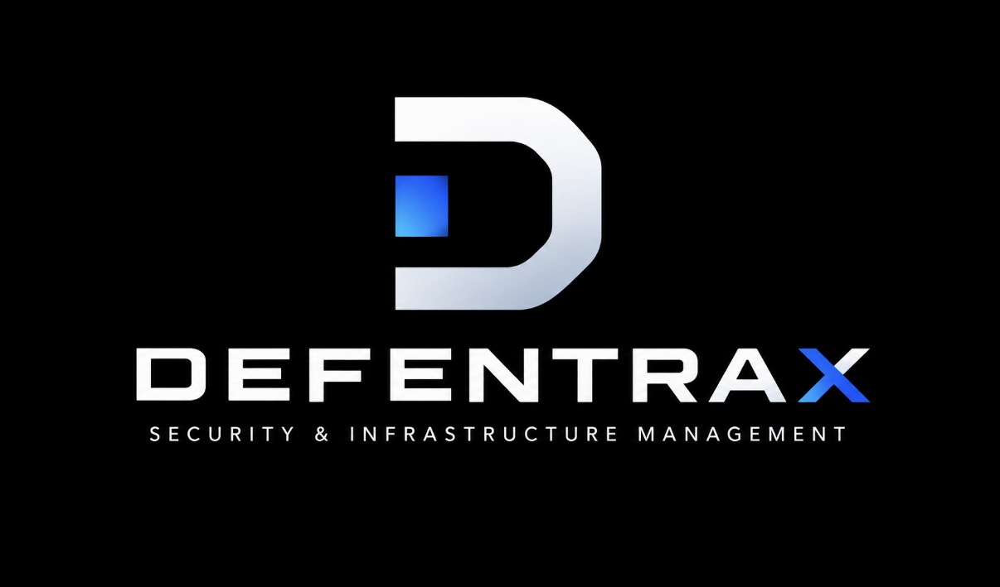

# Defentrax documentation (in-repo)

Operator and developer documentation living alongside the codebase.

  

**Tagline:** SECURITY & INFRASTRUCTURE MANAGEMENT

## Start here

| Doc | Description |
|-----|-------------|
| [architecture.md](architecture.md) | Components, trust boundaries, data flow |
| [installation.md](installation.md) | Compose / Kubernetes / Helm / bare metal |
| [configuration.md](configuration.md) | Environment variables |
| [troubleshooting.md](troubleshooting.md) | Common failure modes |

## Product areas

| Doc | Description |
|-----|-------------|
| [agent.md](agent.md) | Install, enrollment, collectors |
| [docker-monitoring.md](docker-monitoring.md) | Optional Docker Engine monitoring |
| [detection-engine.md](detection-engine.md) | Rule evaluation worker |
| [rules.md](rules.md) | YAML schema and authoring |
| [api.md](api.md) | REST, auth schemes, OpenAPI / Swagger |
| [plugins.md](plugins.md) | Plugin SDK v1 and load policy |

## Operate & secure

| Doc | Description |
|-----|-------------|
| [deployment.md](deployment.md) | Images, volumes, healthchecks, K8s/Helm notes |
| [security.md](security.md) | Hardening, CSRF/TLS, residual risks |
| [../../SECURITY.md](../../SECURITY.md) | Vulnerability reporting |
| [privacy.md](privacy.md) | Data categories and operator duties |
| [retention.md](retention.md) | Retention policy (honest: no auto-purge yet) |
| [backup.md](backup.md) | Backup / restore |
| [release.md](release.md) | Tagging, CI release workflow, SBOM/checksum commands |
| [compatibility.md](compatibility.md) | Version matrix and upgrade expectations |

## Develop

| Doc | Description |
|-----|-------------|
| [contributing.md](contributing.md) | Pointer to root contributor guide |
| [../../CONTRIBUTING.md](../../CONTRIBUTING.md) | Setup, PR expectations |
| [../../CODE_OF_CONDUCT.md](../../CODE_OF_CONDUCT.md) | Community standards |
| [testing.md](testing.md) | Unit / integration matrix |
| [ci.md](ci.md) | GitHub Actions ↔ Make |

## License (open decision)

There is **no `LICENSE` file** in the repository yet.

| Recommendation | Notes |
|----------------|-------|
| **Apache-2.0** (preferred) | Patent grant; enterprise-friendly |
| **MIT** | Minimal terms |

Record an explicit maintainer decision before adding a license file. Do not treat README “open-source” wording as a grant of rights until then.

## Screenshots

Placeholders: [assets/screenshots/](assets/screenshots/).

## Deploy module READMEs

- [../deployments/kubernetes/README.md](../deployments/kubernetes/README.md)
- [../deployments/helm/sentinel/README.md](../deployments/helm/sentinel/README.md)
- [../deployments/docker-compose/README.md](../deployments/docker-compose/README.md)
